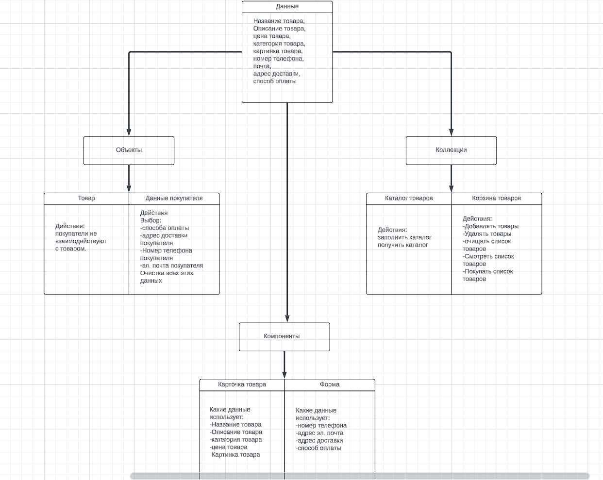
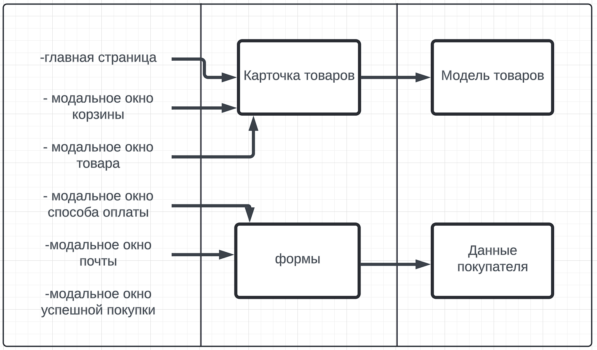

# Проектная работа "Веб-ларек"

Стек: HTML, SCSS, TS, Webpack

Структура проекта:
- src/ — исходные файлы проекта
- src/components/ — папка с JS компонентами
- src/components/base/ — папка с базовым кодом

Важные файлы:
- src/pages/index.html — HTML-файл главной страницы
- src/types/index.ts — файл с типами
- src/index.ts — точка входа приложения
- src/styles/styles.scss — корневой файл стилей
- src/utils/constants.ts — файл с константами
- src/utils/utils.ts — файл с утилитами

## Установка и запуск
Для установки и запуска проекта необходимо выполнить команды

```
npm install
npm run start
```

или

```
yarn
yarn start
```
## Сборка

```
npm run build
```

или

```
yarn build
```

Описание данных

Стэк приложения:
-TypeScript
-Scss
-webpack

Артхитектура проекта:
UML



====================================

Презентеры
Презентеры будут включать логику для управления взаимодействием между моделями и представлениями.


// Интерфейс презентера для корзины
interface IBasketPresenter {
    addProductToBasket(productId: string): void;
    removeProductFromBasket(productId: string): void;
}

// Презентер для корзины
class BasketPresenter implements IBasketPresenter {
    private basket: IBasket;
    private view: IBasketView;

    constructor(basket: IBasket, view: IBasketView) {
        this.basket = basket;
        this.view = view;
    }

    addProductToBasket(productId: string): void {
        this.basket.add(productId);
        this.view.updateBasket(this.basket.items);
    }

    removeProductFromBasket(productId: string): void {
        this.basket.remove(productId);
        this.view.updateBasket(this.basket.items);
    }
}

// Интерфейс представления для корзины
interface IBasketView {
    updateBasket(items: Map<string, number>): void;
}

// Пример представления для корзины
class BasketView implements IBasketView {
    updateBasket(items: Map<string, number>): void {
        // Обновление отображения корзины
        console.log("Basket updated: ", items);
    }
}
Описание компонентов
Модель
IProduct: Интерфейс для представления продукта.
Product: Класс для создания продукта.
IBasket: Интерфейс для корзины покупок.
Basket: Класс для управления корзиной покупок.
ITopay: Интерфейс для представления способа оплаты.
ToPay: Класс для управления способами оплаты.
IUser: Интерфейс для представления данных о пользователе.
User: Класс для управления данными о пользователе.
IApiClient: Интерфейс для API клиента.
Представление
IBasketView: Интерфейс представления для корзины.
BasketView: Класс, реализующий представление корзины.
Презентер
IBasketPresenter: Интерфейс презентера для корзины.
BasketPresenter: Класс презентера для управления корзиной покупок.
Взаимодействие компонентов
Создание экземпляров:

При запуске приложения создаются экземпляры моделей (Product, Basket, ToPay, User).
Создаются экземпляры представлений (BasketView).
Создаются экземпляры презентеров (BasketPresenter), связывающие модели и представления.
Добавление/Удаление товара в корзину:

Пользователь взаимодействует с представлением (например, нажимает кнопку "Добавить в корзину").
Презентер (BasketPresenter) вызывает метод add у экземпляра Basket.
Basket обновляет карту items.
Презентер вызывает метод updateBasket у представления (BasketView), обновляя отображение корзины.
Пример взаимодействия при добавлении товара
Пользователь нажимает кнопку "Добавить в корзину".
BasketPresenter вызывает метод add у экземпляра Basket.
Basket обновляет карту items и уведомляет презентер.
BasketPresenter вызывает метод updateBasket у BasketView, который обновляет интерфейс.
Компоненты приложения
Model:

Product
Basket
ToPay
User
IApiClient
View:

BasketView
Presenter:

BasketPresenter
Реализация процессов в приложении
Процессы в приложении реализованы через событийную модель. Презентеры обрабатывают действия пользователя и обновляют представление, взаимодействуя с моделью для получения и изменения данных. Например, добавление товара в корзину обновляет корзину и вызывает обновление интерфейса корзины.

IProduct

interface IProduct {
    id: string;
    description: string;
    image: string;
    title: string;
    category: string;
    price: number | null;
}
Описание:
Интерфейс для представления продукта. Описывает структуру данных продукта.

id: Уникальный идентификатор продукта.
description: Описание продукта.
image: Ссылка на изображение продукта.
title: Название продукта.
category: Категория продукта.
price: Цена продукта, может быть null.
Product


class Product implements IProduct {
    id: string;
    description: string;
    image: string;
    title: string;
    category: string;
    price: number | null;

    constructor(id: string, description: string, image: string, title: string, category: string, price: number | null) {
        this.id = id;
        this.description = description;
        this.image = image;
        this.title = title;
        this.category = category;
        this.price = price;
    }
}
Описание:
Класс для создания продукта. Реализует интерфейс IProduct. Конструктор принимает параметры для инициализации всех полей продукта.

constructor(id: string, description: string, image: string, title: string, category: string, price: number | null): Инициализирует поля продукта.
IBasket


interface IBasket {
    items: Map<string, number>;
    add(id: string): void;
    remove(id: string): void;
}
Описание:
Интерфейс для корзины покупок. Описывает методы для добавления и удаления товаров в корзину.

items: Карта, содержащая идентификаторы продуктов и их количество.
add(id: string): Метод для добавления продукта в корзину по его идентификатору.
remove(id: string): Метод для удаления продукта из корзины по его идентификатору.
Basket


class Basket implements IBasket {
    items: Map<string, number>;

    constructor() {
        this.items = new Map<string, number>();
    }

    add(id: string): void {
        if (this.items.has(id)) {
            this.items.set(id, this.items.get(id)! + 1);
        } else {
            this.items.set(id, 1);
        }
    }

    remove(id: string): void {
        if (this.items.has(id)) {
            const count = this.items.get(id)!;
            if (count > 1) {
                this.items.set(id, count - 1);
            } else {
                this.items.delete(id);
            }
        }
    }
}
Описание:
Класс для управления корзиной покупок. Реализует интерфейс IBasket.

constructor(): Инициализирует пустую карту items.
add(id: string): Добавляет продукт в корзину по его идентификатору.
remove(id: string): Удаляет продукт из корзины по его идентификатору или уменьшает его количество.
ITopay


interface ITopay {
    paymentMethod: boolean;
    address: string;
}
Описание:
Интерфейс для представления способа оплаты. Описывает структуру данных способа оплаты.

paymentMethod: Логическое значение, указывающее, используется ли данный способ оплаты.
address: Адрес доставки.
ToPay


class ToPay implements ITopay {
    paymentMethod: boolean;
    address: string;

    constructor(paymentMethod: boolean, address: string) {
        this.paymentMethod = paymentMethod;
        this.address = address;
    }
}
Описание:
Класс для управления способами оплаты. Реализует интерфейс ITopay. Конструктор принимает параметры для инициализации полей paymentMethod и address.

constructor(paymentMethod: boolean, address: string): Инициализирует поля paymentMethod и address.
IUser

interface IUser {
    email: string;
    telephone: string;
}
Описание:
Интерфейс для представления данных о пользователе. Описывает структуру данных пользователя.

email: Электронная почта пользователя.
telephone: Телефонный номер пользователя.
User


class User implements IUser {
    email: string;
    telephone: string;

    constructor(email: string, telephone: string) {
        this.email = email;
        this.telephone = telephone;
    }
}
Описание:
Класс для управления данными о пользователе. Реализует интерфейс IUser. Конструктор принимает параметры для инициализации полей email и telephone.

constructor(email: string, telephone: string): Инициализирует поля email и telephone.
IApiClient

interface IApiClient {
    get<T>(uri: string): Promise<T>;
    post<T>(uri: string, data: object, method?: ApiPostMethods): Promise<T>;
    put<T>(uri: string, data: object): Promise<T>;
    delete<T>(uri: string): Promise<T>;
}
Описание:
Интерфейс для API клиента. Описывает методы для взаимодействия с внешним API.

get<T>(uri: string): Promise<T>: Выполняет GET запрос по заданному URI и возвращает Promise с данными типа T.
post<T>(uri: string, data: object, method?: ApiPostMethods): Promise<T>: Выполняет POST запрос по заданному URI с переданными данными и возвращает Promise с данными типа T.
put<T>(uri: string, data: object): Promise<T>: Выполняет PUT запрос по заданному URI с переданными данными и возвращает Promise с данными типа T.
delete<T>(uri: string): Promise<T>: Выполняет DELETE запрос по заданному URI и возвращает Promise с данными типа T.
IBasketPresenter

interface IBasketPresenter {
    addProductToBasket(productId: string): void;
    removeProductFromBasket(productId: string): void;
}
Описание:
Интерфейс презентера для корзины покупок. Описывает методы для управления добавлением и удалением товаров в корзине.

addProductToBasket(productId: string): Метод для добавления продукта в корзину.
removeProductFromBasket(productId: string): Метод для удаления продукта из корзины.
BasketPresenter


class BasketPresenter implements IBasketPresenter {
    private basket: IBasket;
    private view: IBasketView;

    constructor(basket: IBasket, view: IBasketView) {
        this.basket = basket;
        this.view = view;
    }

    addProductToBasket(productId: string): void {
        this.basket.add(productId);
        this.view.updateBasket(this.basket.items);
    }

    removeProductFromBasket(productId: string): void {
        this.basket.remove(productId);
        this.view.updateBasket(this.basket.items);
    }
}
Описание:
Класс презентера для корзины покупок. Реализует интерфейс IBasketPresenter. Конструктор принимает экземпляры IBasket и IBasketView для управления логикой корзины и ее отображением.

constructor(basket: IBasket, view: IBasketView): Инициализирует презентер с корзиной и представлением.
addProductToBasket(productId: string): Добавляет продукт в корзину и обновляет представление.
removeProductFromBasket(productId: string): Удаляет продукт из корзины и обновляет представление.
IBasketView

interface IBasketView {
    updateBasket(items: Map<string, number>): void;
}
Описание:
Интерфейс представления для корзины. Описывает метод для обновления отображения корзины.

updateBasket(items: Map<string, number>): Метод для обновления отображения корзины.
BasketView


class BasketView implements IBasketView {
    updateBasket(items: Map<string, number>): void {
        // Обновление отображения корзины
        console.log("Basket updated: ", items);
    }
}
Описание:
Класс, реализующий представление корзины. Реализует интерфейс IBasketView.

updateBasket(items: Map<string, number>): Обновляет отображение корзины.
Взаимодействие компонентов
Создание экземпляров:

При запуске приложения создаются экземпляры моделей (Product, Basket, ToPay, User).
Создаются экземпляры представлений (BasketView).
Создаются экземпляры презентеров (BasketPresenter), связывающие модели и представления.
Добавление/Удаление товара в корзину:

Пользователь взаимодействует с представлением (например, нажимает кнопку "Добавить в корзину").
Презентер (BasketPresenter) вызывает метод add у экземпляра Basket.
Basket обновляет карту items.
Презентер вызывает метод updateBasket у представления (BasketView), обновляя отображение корзины.
Пример взаимодействия при добавлении товара
Пользователь нажимает кнопку "Добавить в корзину".
BasketPresenter вызывает метод add у экземпляра Basket.
Basket обновляет карту items и уведомляет презентер.
BasketPresenter вызывает метод updateBasket у BasketView, который обновляет интерфейс.
Компоненты приложения
Model:

Product
Basket
ToPay
User
IApiClient
View:

BasketView
Presenter:

BasketPresenter
Реализация процессов в приложении
Процессы в приложении реализованы через событийную модель. Презентеры обрабатывают действия пользователя и обновляют представление, взаимодействуя с моделью для получения и изменения данных. Например, добавление товара в корзину обновляет корзину и вызывает обновление интерфейса корзины.